# NotesAI

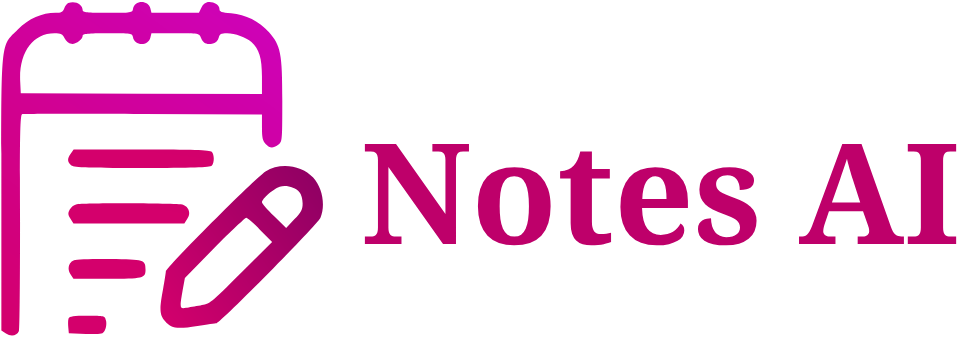

---

NotesAI is an intelligent note-taking web app designed to help users write, manage, and enhance their notes with the power of AI. It supports features like summarization, note locking, image-to-note generation, and an AI Assistant that interacts with your notes in real-time.

---

## 📌 About This Repository

This repository is a **public overview** of the NotesAI project. It is intended to showcase the design and features of the application.

### 🔒 Important Note:
> The **actual source code is maintained in a private repository**, as the web application is still under active development. This repo contains selected files, screenshots, and descriptions to give an idea of how NotesAI works.

---

## 🖼️ Application Screenshots

<strong>📸 Click to View Screenshots</strong>

### 🔹 Email-based Registration
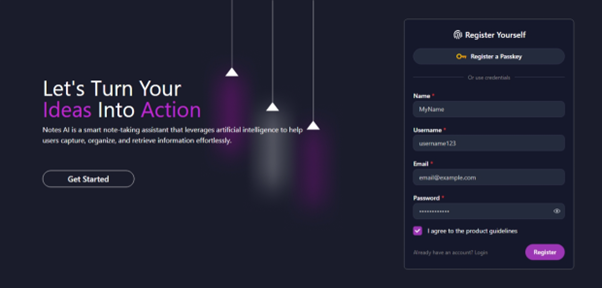

### 🔹 Email Login
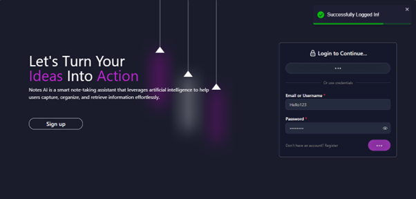

### 🔹 Passkey Registration
Store credentials securely on-device or with external hardware.
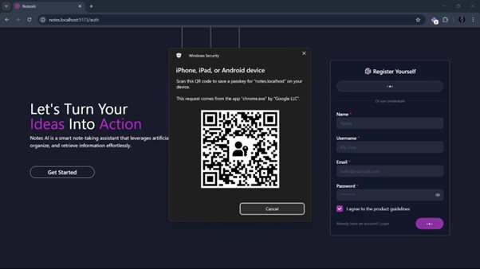

### 🔹 Passkey Login (Mobile Example)
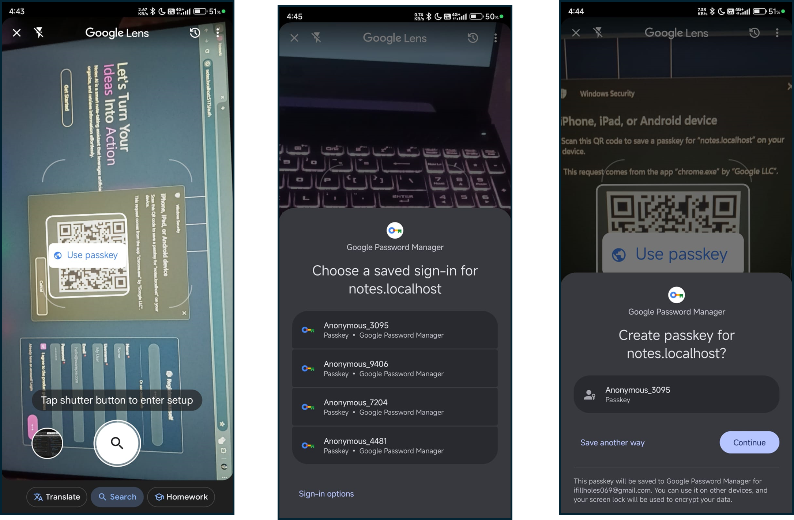

### 🔹 Main Dashboard
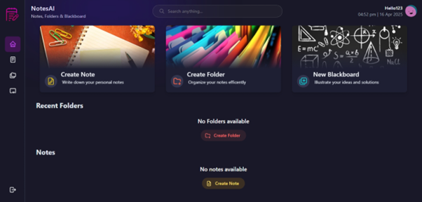

### 🔹 Creating a Note
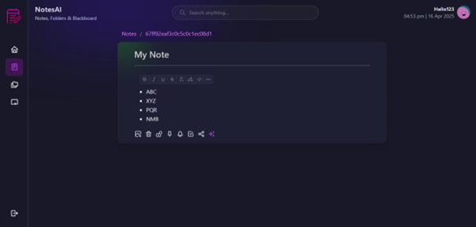

### 🔹 Viewing Notes
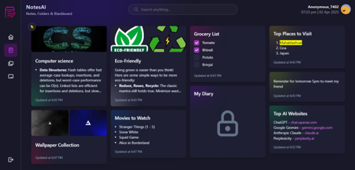

### 🔹 Creating a Folder
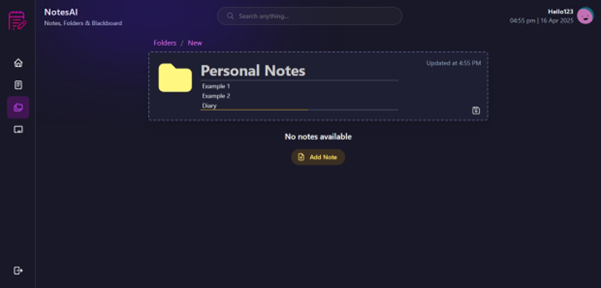

### 🔹 Viewing Folders
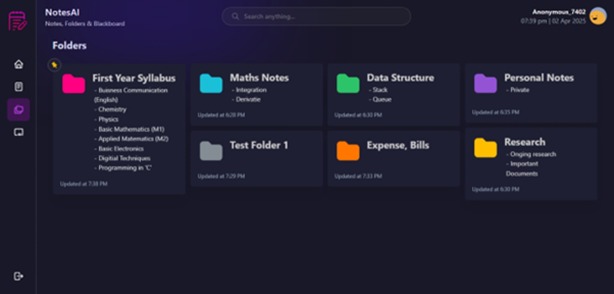

### 🔹 Adding Note to Folder
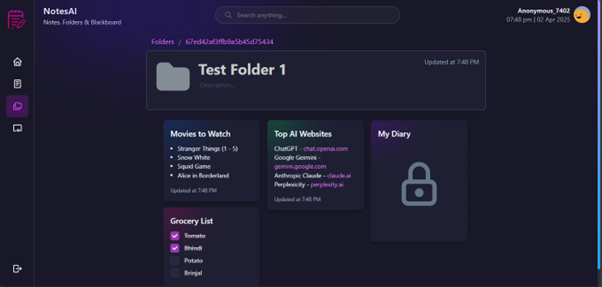

### 🔹 Blackboard Mode
Draw, sketch, or scribble with AI-enabled recognition.
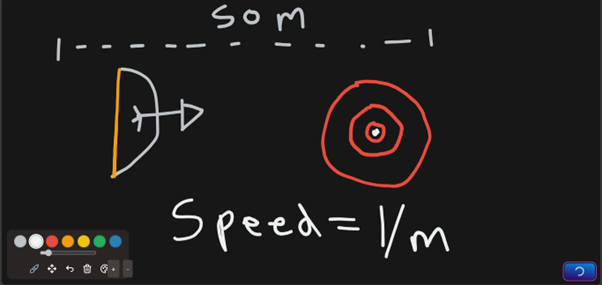
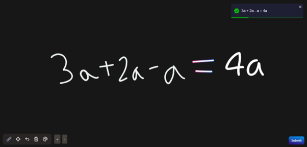

### 🔹 AI Assistant
Summarize, rephrase, highlight, or generate notes via AI.
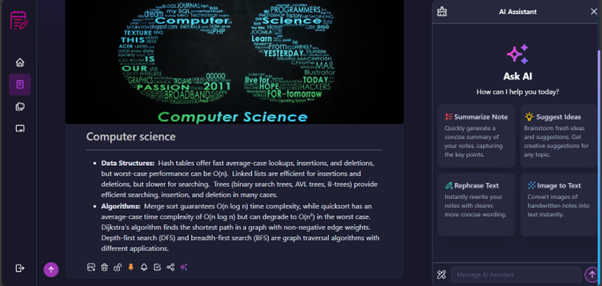

### 🔹 AI Diagram Generator
Generate flowcharts, ER diagrams, pie charts, bar graphs, and more.
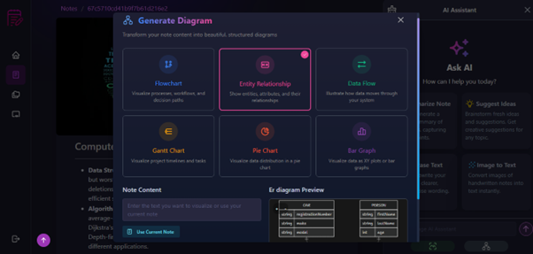

### 🔹 Using Diagrams in Blackboard
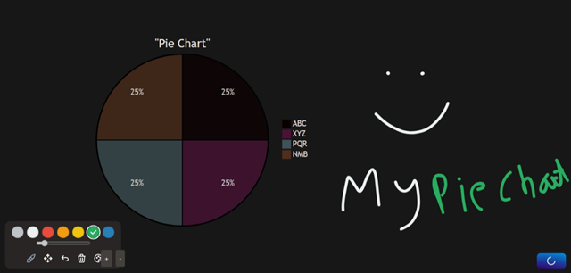

### 🔹 Image to Note
Capture physical notes using mobile and convert them to digital.
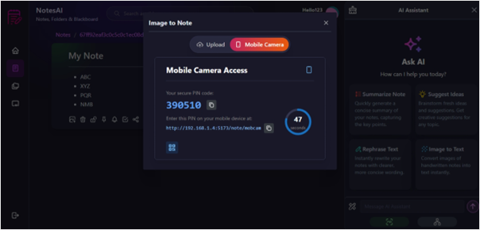
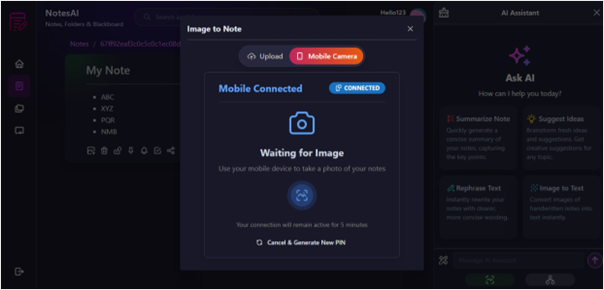
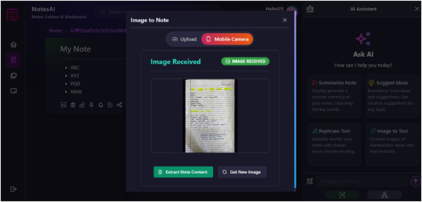
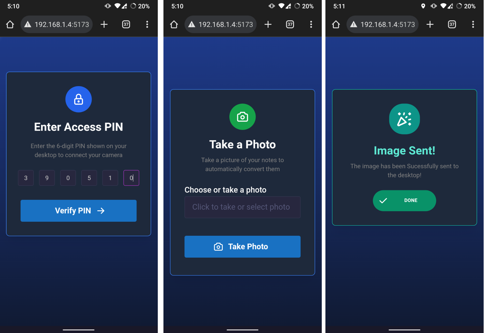

---

## 🚀 Features Overview

- 🔐 Passkey-based authentication (WebAuthn)
- 🔑 AES-256-GCM client-side encrypted notes
- 🧠 AI-powered summarization, rephrasing, idea generation
- 📸 Convert images into notes (OCR + AI)
- ✏️ Draw or write on a digital canvas with AI processing
- 📊 Auto-generate diagrams and charts (flowcharts, pie, bar, gantt, ER)
- 📁 Folder management and note organization
- 🔍 Smart search and categorization

---

## ⚙️ Tech Stack

- **Frontend**: React + TailwindCSS
- **Backend**: Express.js
- **Database**: MongoDB Atlas
- **Mobile App**: Flutter
- **Authentication**: WebAuthn (Passkeys), bcrypt
- **AI Integration**: Gemini API (Google), OCR
- **Encryption**: AES-256-GCM (Client-side)

---

## 📣 Status

> NotesAI is currently under development.  
> The source code is private until final release.

---

## 📬 Contact

If you're interested in learning more, collaborating, or providing feedback, feel free to [open an issue](https://github.com/aaron529/notes-ai-overview/issues) or contact me directly.

---
